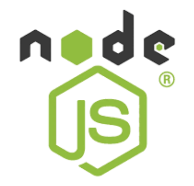
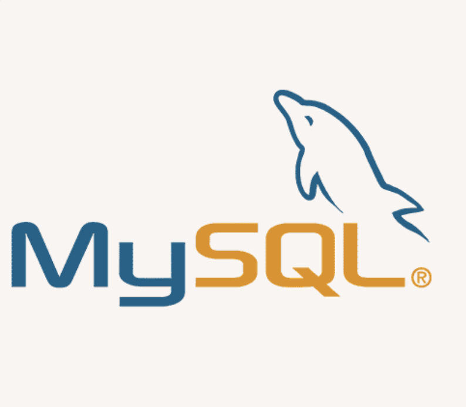
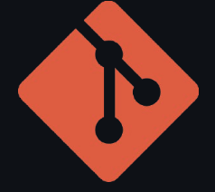

<a href="https://club-project-one.vercel.app/" target="_blank">

</a>
<br/>
<br/>

# 0. Getting Started (시작하기!)


<br/>
<br/>

# 1. Project Overview (프로젝트 개요)

- 프로젝트 이름: Umai!
- 프로젝트 설명: 개인맞춤형 맛집추천 어플

<br/>
<br/>

# 2. Team Members (팀원 및 팀 소개)

|                            박호연                            |                            김진태                            |                               전주환                               |
| :----------------------------------------------------------: | :----------------------------------------------------------: | :----------------------------------------------------------------: |
|  |  |  |
|                             사원                             |                             팀장                             |                                인턴                                |
|         [GitHub](https://github.com/HoYeonPark1221)          |           [GitHub](https://github.com/KimJinTae1)            |                             [GitHub](https://github.com/wnghks114)                             |

<br/>
<br/>

# 3. Key Features (주요 기능)

- **회원가입**:

  - 회원가입 전 설문을 통해 맛BTI 정보를 수집합니다.
  - 회원가입 시 DB에 유저정보가 등록됩니다.

- **로그인**:

  - 사용자 인증 정보를 통해 로그인합니다.
  - 토큰 인증으로 진행합니다.

- **내 맛BTI로 맛집 추천**:

  - 설문조사로 통해 맛BTI 도출
  - 맛BTI별 음식 추천

- **Umai가 선정한 맛집**:
  - 인증된 맛집을 유저들에게 제공
  -
- **유저 프로필**:
  - 해당 맛BTI를 보여주고 맛BTI카드라는 재미요소를 추가함
  - 프로필 편집기능
  - 친구들에게 공유하는 기능(맛BTI카드 or QR카드)

<br/>
<br/>

# 4. Tasks & Responsibilities (작업 및 역할 분담)

|        |                                                                    |                                                                                                                               |
| ------ | ------------------------------------------------------------------ | ----------------------------------------------------------------------------------------------------------------------------- |
| 박호연 |        | <ul><li>프론트엔드</li><li>매인 화면 구현</li><li>Umai Picks화면 구현</li><li> 맛BTI 카드 구현</li><li> 디자인 설계</li></ul> |
| 김진태 |        | <ul><li>백엔드</li><li>DB설계</li><li>프론트-백 통신 담당</li><li>앱 기획담당</li></ul>                                       |
| 전주환 |  | <ul><li>프론트엔드</li><li>개인화면 수정</li><li>프론트와 백앤드 연동 분석및 구현</li><li>로고 제작</li></ul>                 |

<br/>
<br/>

# 5. Technology Stack (기술 스택)

## 5.1 Frotend

|         |                                                        |     |
| ------- | ------------------------------------------------------ | --- |
| SwiftUI |  | 5.0 |

<br/>

## 5.2 Backend

|         |                                                          |        | 특이사항                                             |
| ------- | -------------------------------------------------------- | ------ | ---------------------------------------------------- |
| Node.js |  | 23.2.0 | "https://github.com/wannabewize/nodejs-samples" 참고 |
| MySQl   |    | 8.0.0  | AWS에 데이터베이스 배포 완료                    |

## 5.3 Cooperation

|        |                                                         |
| ------ | ------------------------------------------------------- |
| git    |    |
| notion |  |

<br/>
<br/>

# 6. Project Structure (프로젝트 구조)

## 6.1 Frontend

```plaintext

UMai/
├── UMAiApp                     # 앱의 메인 엔트리 포인트
├── ContentView                 # 앱의 전체적인 컨텐츠를 관리하는 뷰
│
├── Model/                      # 데이터 모델과 관련된 파일들
│   ├── restaurant              # 레스토랑 모델 데이터
│   ├── RestaurantViewModel     # 레스토랑 데이터를 처리하는 ViewModel
│   └── RegisterViewModel       # 사용자 등록 관련 데이터를 처리하는 ViewModel
│
├── Login/                      # 로그인 및 설문과 관련된 뷰 파일들
│   ├── LoginView               # 로그인 화면
│   ├── SurveyView              # 설문조사 화면
│   ├── MatBtiResultView        # 맛BTI 결과 화면
│   └── SignupView              # 회원가입 화면
│
├── Font/                       # 프로젝트에 사용되는 폰트 파일들
│   ├── DMSerifDisplay-Italic
│   ├── DMSerifDisplay-Regular
│   ├── Poppins-ExtraLightItalic
│   └── Liquefier
│
├── Info                        # 추가적인 정보나 데이터 파일들
│
├── Sub/                        # 서브 뷰와 관련된 화면들
│   ├── ListView                # 목록 화면
│   └── DetailView              # 상세 보기 화면
│
├── Person/                     # 개인화된 화면 및 기능 관련 파일들
│   ├── PersonView              # 사용자 개인 페이지
│   └── ShareBTIView            # 맛BTI 결과 공유 페이지
│
├── Main/                       # 메인 화면과 관련된 파일들
│   └── HomeView                # 홈 화면
│
├── Assets                      # 이미지, 아이콘 등 정적 파일들을 저장하는 폴더
│
└── Preview Content/            # 프로젝트의 미리보기 관련 파일들
    └── Preview Assets          # 미리보기에 필요한 에셋 파일
```

</br>
</br>

## 6.2 Backend

```plaintext
UMAI_BACK/
├── config/                   # 설정 파일 (DB, 환경변수 등)
│
├── controllers/              # 비즈니스 로직 처리 (컨트롤러)
│   └── restaurant.js        # 레스토랑 관련 컨트롤러
│
├── middlewares/              # 미들웨어 (인증 및 요청 처리)
│   └── auth.js              # 인증 관련 미들웨어
│
├── models/                   # 데이터베이스 모델 정의
│   ├── mbti.js              # MBTI 모델
│   ├── menus.js             # 메뉴 모델
│   ├── restaurant.js        # 레스토랑 모델
│   └── user.js              # 사용자 모델
│
├── node_modules/             # 설치된 npm 패키지
│
├── passport/                 # 인증 관련 전략 설정 (예: JWT, 로컬)
│
├── routers/                  # 라우터 정의 (URL 라우팅)
│   ├── auth.js              # 인증 관련 라우팅
│   ├── restaurant.js        # 레스토랑 관련 라우팅
│   └── user.js              # 사용자 관련 라우팅
│
├── views/                    # 뷰 파일 (EJS 템플릿)
│   └── index.js             # 메인 페이지 (EJS 템플릿 엔진 사용)
│
├── index.js                  # 메인 애플리케이션 진입점
├── package-lock.json         # 종속성 버전 기록 파일
├── package.json              # 프로젝트 설정 및 종속성
└── seed.js                   # 초기 데이터베이스 시드 스크립트
```

<br/>
<br/>

## 7. Development Workflow (개발 워크플로우)

### 브랜치 전략 (Branch Strategy)

저희는 전략은 단순하고 효율적인 **Main Branch 작업 방식**을 따릅니다.

#### Main Branch

- 모든 작업과 개발은 **Main 브랜치**에서 직접 이루어집니다.
- 배포 가능한 상태를 유지하기 위해 코드 푸시 전에 철저한 테스트를 진행합니다.
- 팀원 간의 긴밀한 커뮤니케이션을 통해 충돌을 방지합니다.
- Pull Request 없이, 변경 사항은 직접 Main 브랜치에 커밋합니다.

#### 기타

- 별도의 개발 브랜치 없이 작업하며, 완성된 기능을 바로 Main 브랜치에 반영합니다.
- 코드 리뷰는 필요 시 구두나 비공식적으로 진행합니다.
- 코드 작성시에 대면으로 커밋을 보고합니다.
- 최대한 수업시간 내에 모여있는 시간에 개발을 시작하고 마무리합니다.
